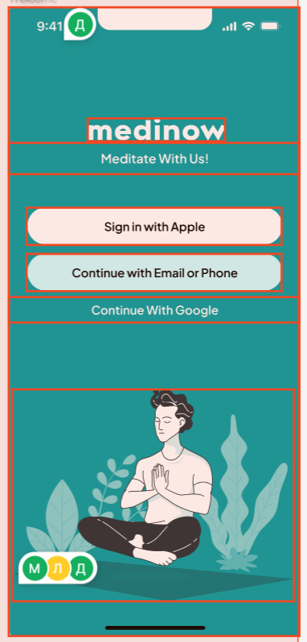
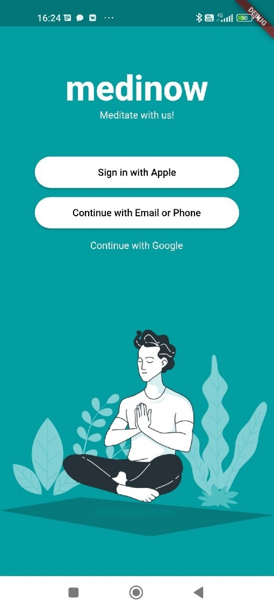
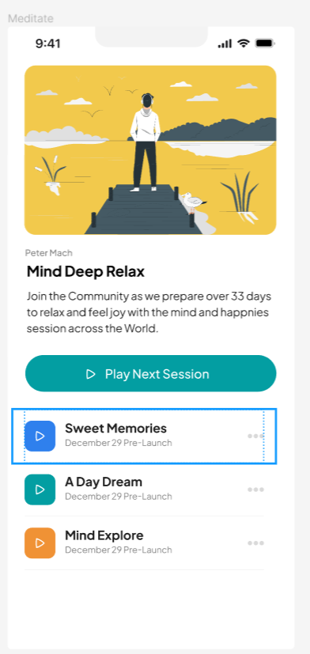
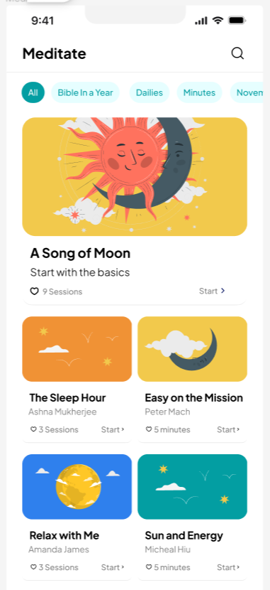
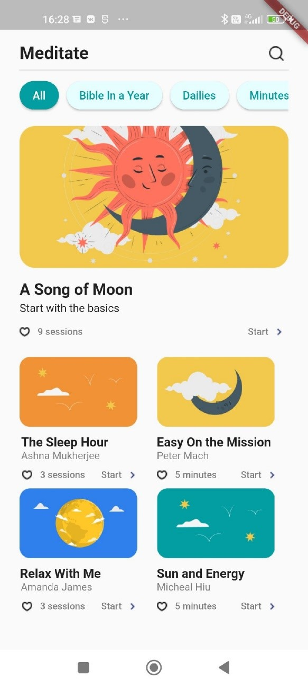

# Практическая работа №1

Работа с основными виджетами
Цель работы: изучить основные виджеты и создать несколько макетов по образцу.
Ход работы: 
Выбираем первый макет.

Рисунок 1 - Первый выбранный макет

Добавляем в Scaffold SafeArea и настраиваем отступ при помощи ключа minimum. В качестве child используем Column. При помощи ключа children добавляем сюда виджеты. Используем такие виджеты как Text, ElevatedButton, Container и Image. Меняем текст при помощи ключей style, fontsize, color, fontweight. Скругляем кнопки при помощи 
style: ElevatedButton.styleFrom(
shape: const StadiumBorder(),
Добавляем картинку при помощи Image (не забываем добавлять ее в pubspec.yaml). Оборачиваем ее в Expanded, чтобы она занимала все оставшееся пространство.
Изменяем цвет фона при помощи 
backgroundColor: const Color.fromRGBO(3, 158, 162, 1));

Результат: 

 

Рисунок 2 - Результат 1

Выбираем второй макет.

Рисунок 3 - Второй макет

Используем такое же начало как и в первом макете.
Оборачиваем Image в контейнер и скругляем его края при помощи  Borderradius. Используем Row и Column для размещения виджетов на экране. Не забываем использовать padding и margin для создания отступов. Используем те же приемы, что и в первом макете.

Результат:

Рисунок 4 - Результат 2

Выбираем третий макет.
 

Рисунок 5 - Третий макет

В работе используем все те же приемы, что и в первых двух макетах.
Результат:

Рисунок 6 - Результат 3

Вывод: удалось изучить основные виджеты и создать несколько макетов по образцу.

