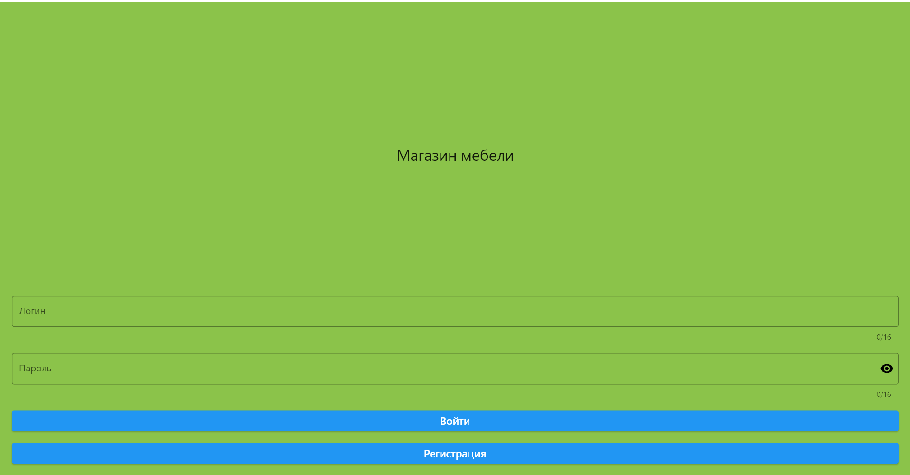
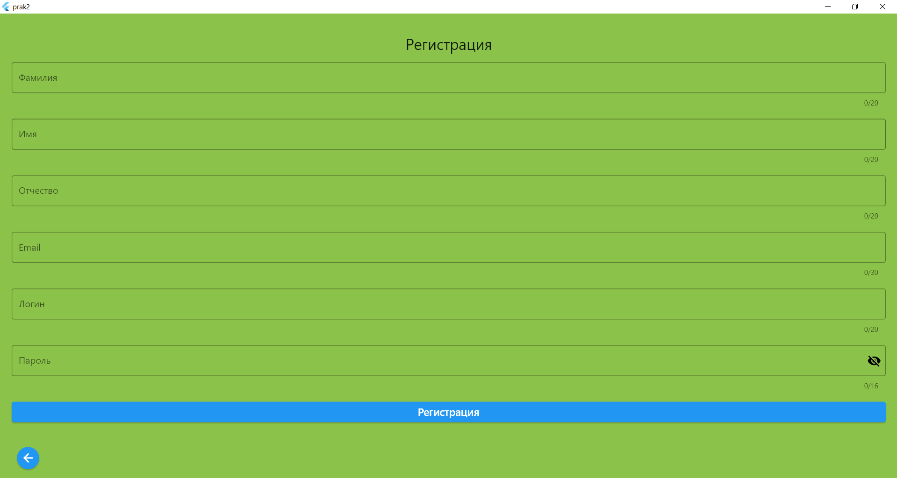
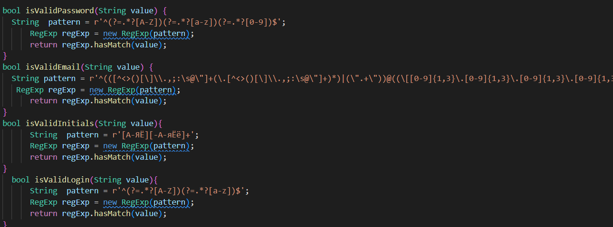
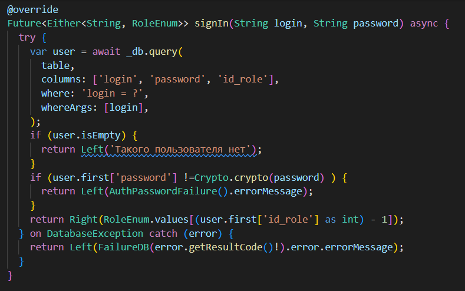
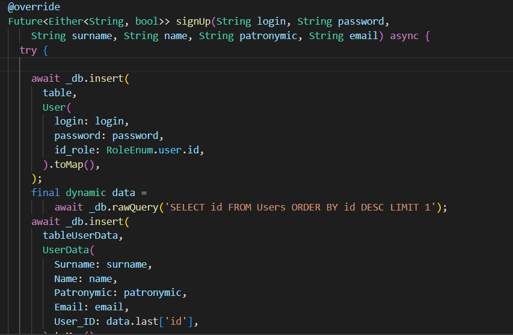
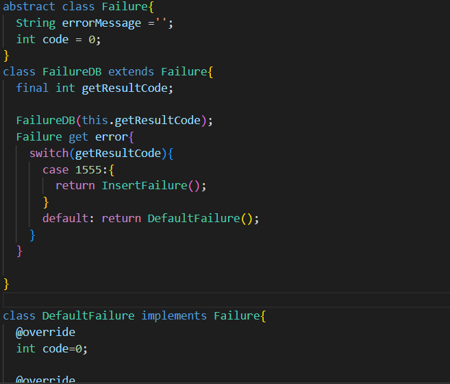
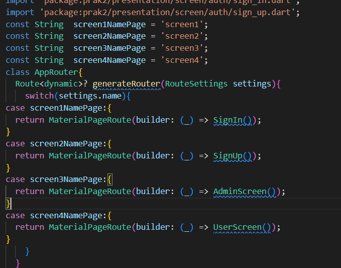

# ПРАКТИЧЕСКАЯ РАБОТА №3
Создание форм авторизации и регистрации
Цель работы: создать формы авторизации и регистрации, прописать логику для них и проверки на поля.

Ход работы:
Создаем формы авторизации и регистрации, прописываем проверки на каждое поле.

Рисунок 1 – Форма авторизации

 

Рисунок 2 – Форма регистрации

 
Рисунок 3 – Проверки полей

Для обеспечения работы процедур авторизации и регистрации работаем с классом AuthRepositoriesImpl.

Рисунок 4 – Метод авторизации

 
Рисунок 5 – Метод регистрации

Также необходимо обработать ошибки БД. Для этого создаем новый класс.

 
Рисунок 6 - Обработка ошибок

Кроме того, создаем процедуру шифрования пароля.

 
Рисунок 7 - Процедура шифрования

Обрабатываем навигацию приложения. Для этого создаем новый класс.

 
Рисунок 8 - Обработка навигации

Вывод: удалось создать формы авторизации и регистрации, прописать логику для них и проверки на поля.
