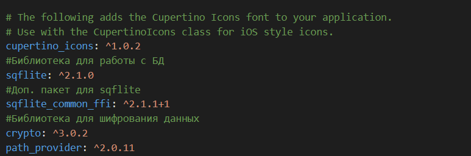
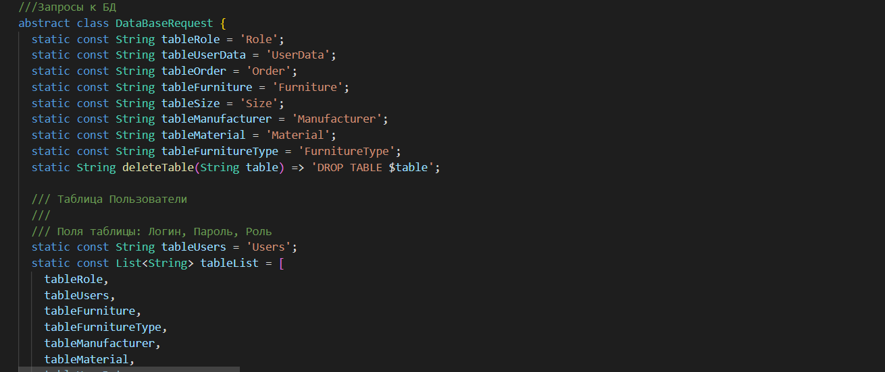
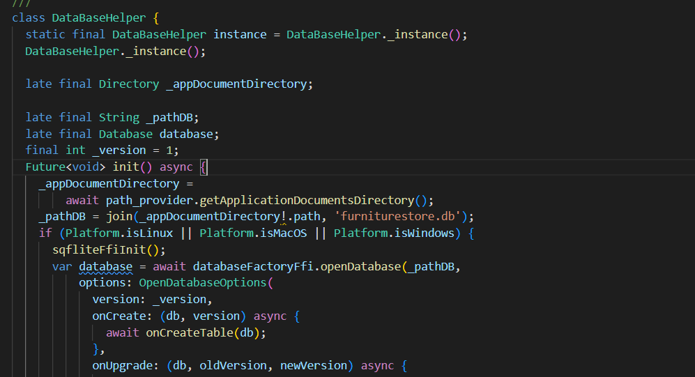
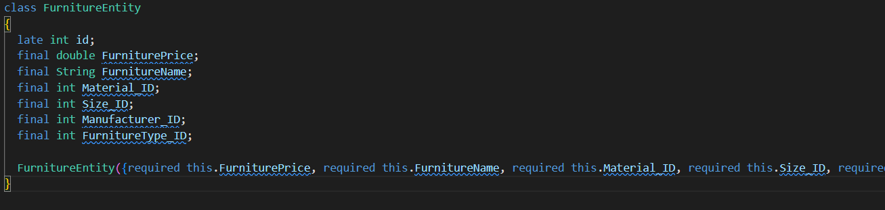
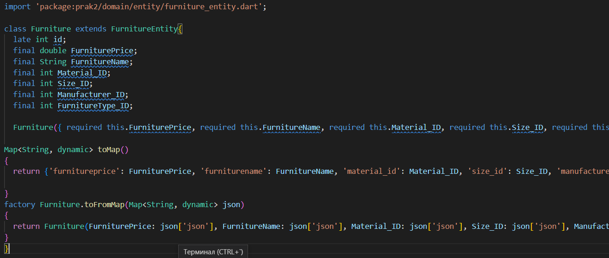
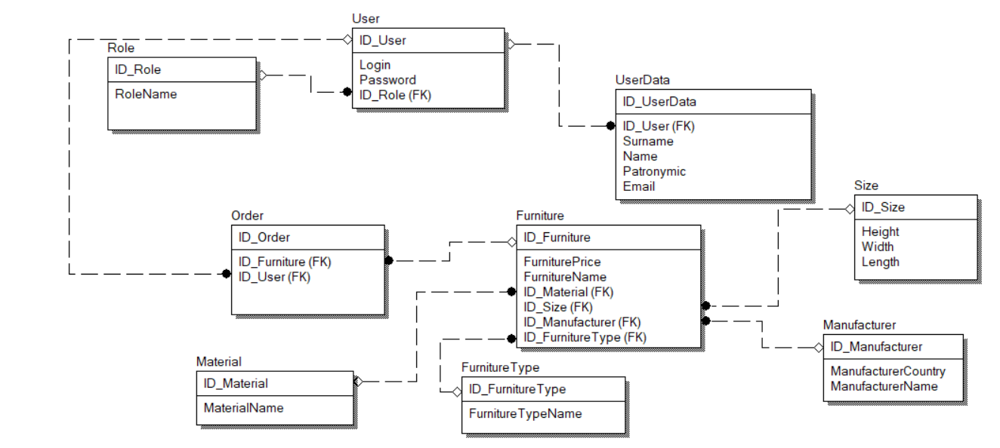

# ПРАКТИЧЕСКАЯ РАБОТА №2
Работа с sqflite
Цель работы: установить необходимые библиотеки, научиться работать с sqflite в flutter, создать базу данных для магазина мебели.

Ход работы:
Устанавливаем необходимые библиотеки.

Рисунок 1 – Библиотеки

Создаем файл databaserequest, в котором будут храниться запросы для БД.
 

Рисунок 2 – databaserequest

Создаем файл databasehelper. В нем будут описаны основные функции для работы с БД, например инициализация БД.

 
Рисунок 3 – databasehelper

Для хранения данных и взаимодействия с ними создаем сущности и модели.

Рисунок 4 – Сущность

 
Рисунок 5 – Модель

Создаем модель и сущность для каждой таблицы БД.

 
Рисунок 6 - Схема БД

Вывод: удалось установить необходимые библиотеки, научиться работать с sqflite в flutter, создать базу данных для магазина мебели.
